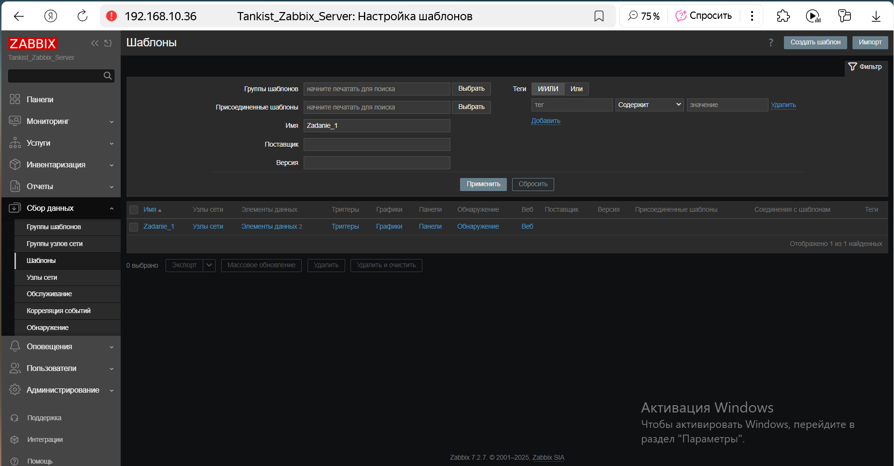
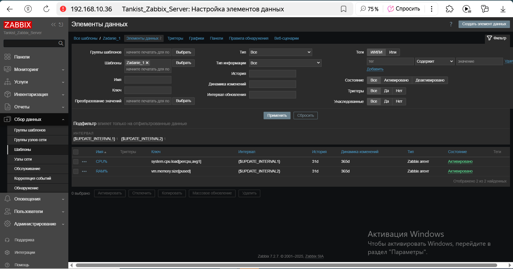
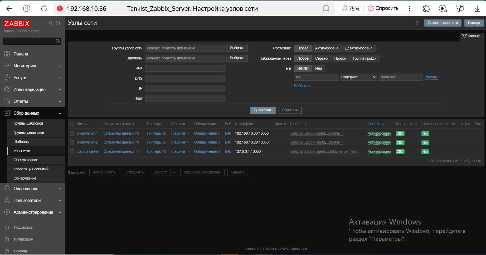
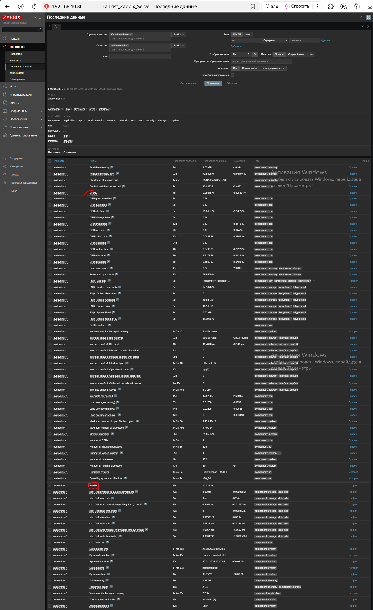
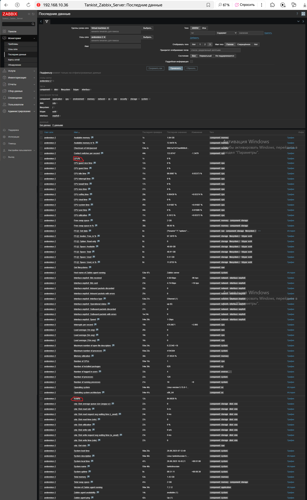
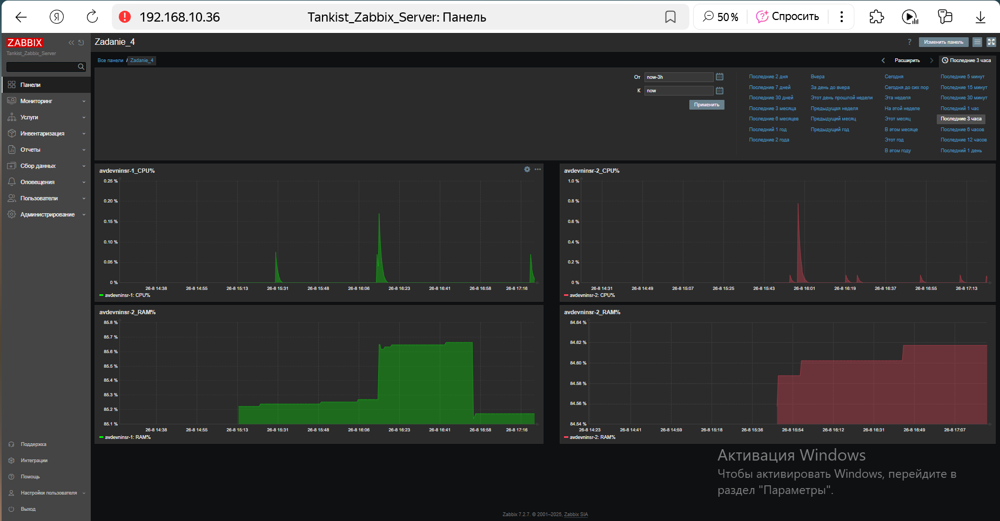

# Домашнее задание к занятию «Система мониторинга Zabbix. Часть 2»
### Цели занятия
1. Научитья создавать свои шаблоны в Zabbix, добавлять в Zabbix хосты и связывать шаблон с хостами
2. Научиться составлять кастомный дашборд
3. Научиться создавать UserParameter на Bash
4. Научиться создавать Python-скрип, добавляться в него UserParameter и прикреплять к шаблону
5. Научиться создавать Vagrant-скрипты для Zabbix Agent

**Названия шаблонов, айтемов и панелей написаны латиницей без пробелов, иначе Zabbix 7.2 выдаёт ошибку!**

## Задание 1
**Решение**  
Скриншоты страниц шаблона с названием «Zadanie_1»  

 
 

## Задание 2-3
**Решение**  
Скриншот с "зелёным" статусом подключения хостов  

 
Скриншот с разделом LatestData хоста avdevninsr-1. Красным овалом обведены айтемы из создавнного в Задании 1 шаблона  

 
Скриншот с разделом LatestData хоста avdevninsr-2. Красным овалом обведены айтемы из создавнного в Задании 1 шаблона  

 

## Задание 4
**Решение**  
Скриншот с изображением дашборда «Zadanie_4»  

 
На данном скриншоте представлены графики параметров загрузки CPU в процентах (верхние графики) и загрузки RAM в процентах (нижние графики) из созданного шаблона «Zadanie_1» для хостов avdevninsr-1 (зелёные графики) и avdevninsr-2 (красные графики).